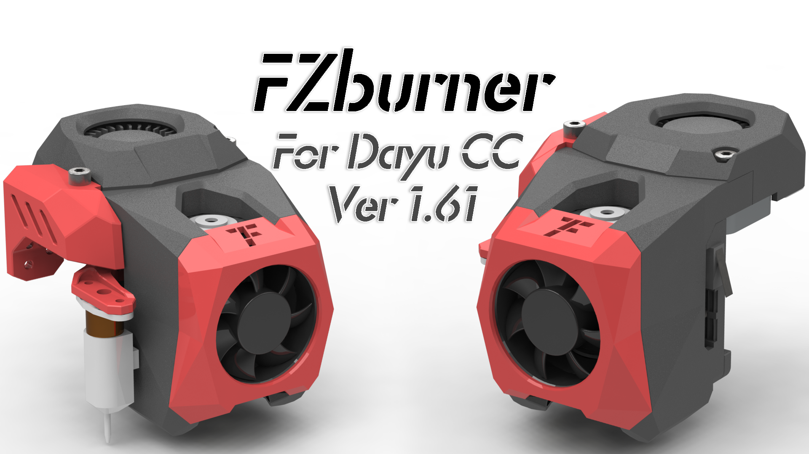

<h1 align="center">FZburner-CC</h1>

**
给大鱼CC 3D打印机设计的一款打印头**

[A burner for the DaYu CC 3D parinter]

 ---
 

 
 ---
  
## 主要功能
> - [x] 远程挤出（近程挤出可选用[**Sherpa Mini挤出机**](https://github.com/Annex-Engineering/Sherpa_Mini-Extruder)或者[**FZ挤出机**](https://github.com/FZaii/FZ-Extruder)等固定孔位间距为43.5mm的挤出机）
> - [x] E3D V6热端
> - [x] 4010热端风扇
> - [x] 4020物料风扇
> - [x] BLTouch安装位
> - [x] [**Klicky/KlickyNG Probe**](https://github.com/jlas1/Klicky-Probe)安装位
> - [x] ADXL 345安装位
 
### 更新历史
> **[Ver 1.5]** 2022.11.19  **可能 也许 大概 真的是最后一版了（没bug反馈的话）**
> - 优化“1_底板”，以增加强度，更稳固的固定热端，简化限位开关走线；
> - 优化“2[1]_热端固定件” ，以更稳固的固定热端；
> - 优化“3_风道主体” ，以加大多个配合面的间隙，修改出风口角度，配合修改后的热端固定件及限位开关走线；
> - 优化“5_4010风扇罩” ，以增加风扇卡扣强度，配合修改后的风道主体；
> - 优化“6_线缆罩” ，以改善打印件效果；
> - 优化“7[2]a_klicky支架”、“9_ADXL345支架” ，以配合修改后的底板外形；
> - 新增“7[1]a_klickyNG支架”等，以安装Klicky NG项目。
 
> **[Ver 1.4]** 2022.10.05
> - “1.底板”增大了上下同步带的间距；
> - “2."风道主体”出风口修改为常见的左右向后出风，优化4010风扇固定孔位及走线；
> - “4.热端风扇罩”修型。
 
> **[Ver 1.3]** 2022.09.11
> - 改动了挺多，应该是大鱼CC的最后一个版本了。
 
> **[Ver 1.2]** 2022.6.15
> - 新增 - 热端固定位置选择。配合4个“3.x热端固定件”可以实现热端的上下微调。
