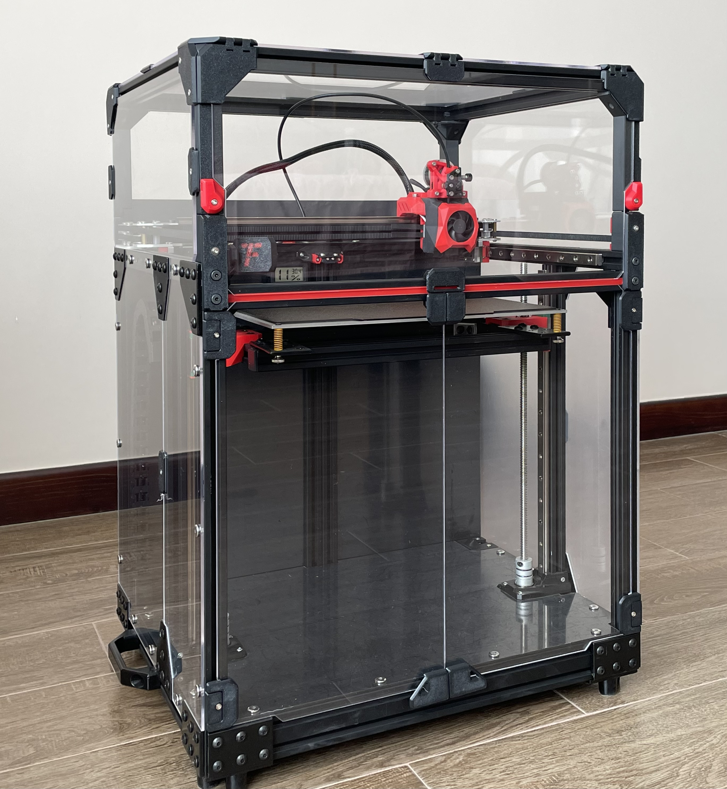

<h1 align="center">FZburner-CC</h1>

**
给大鱼CC 3D打印机设计的一款打印头
**

[A burner for the DaYu CC 3D parinter]

 ---
## **
最终版（v1.6）STEP文件已上传,不再更新！说明文档及打印文件整理上传中……
**
# 
全新FZburner MK2完成进度80%……

 ---
 

 
 ---
  
### 主要功能
> - [x] 远程挤出（近程挤出可选用[**Sherpa Mini挤出机**](https://github.com/Annex-Engineering/Sherpa_Mini-Extruder)或者[**FZ挤出机**](https://github.com/FZaii/FZ-Extruder)等固定孔位间距为43.5mm的挤出机）
> - [x] E3D V6 热端
> - [x] 4010 热端风扇
> - [x] 4020 / 5015 物料风扇
> - [x] BLTouch 安装位
> - [x] [**Klicky/KlickyNG Probe**](https://github.com/jlas1/Klicky-Probe) / [**Euclid Probe**](https://github.com/nionio6915/Euclid_Probe)安装位
> - [x] ADXL345 安装位
 
**>** **<**    ***STL打印文件压缩包（非最新，未更新）***
### 更新历史

> **[Ver 1.6]** 2023.07.02
> - 新增“5015风扇罩”等，以选装5015风扇;
> - 新增“Euclid Probe支架”等，以选装Euclid Probe项目;
> - 优化“4020风扇罩”、“5015风扇罩”，以安装36 PCB集线板（不支持36CAN板）
> - 其他多处修改记不住了

> **[Ver 1.5]** 2022.11.19  
> - 优化“底板”，以增加强度，更稳固的固定热端，简化限位开关走线；
> - 优化“热端固定件” ，以更稳固的固定热端；
> - 优化“风道主体” ，以加大多个配合面的间隙，修改出风口角度，配合修改后的热端固定件及限位开关走线；
> - 优化“4010风扇罩” ，以增加风扇卡扣强度，配合修改后的风道主体；
> - 优化“线缆罩” ，以改善打印件效果；
> - 优化“klicky支架”、“ADXL345支架” ，以配合修改后的底板外形；
> - 新增“klickyNG支架”等，以安装Klicky NG项目。
 
> **[Ver 1.4]** 2022.10.05
> 
> **[Ver 1.3]** 2022.09.11
> 
> **[Ver 1.2]** 2022.06.15
> 
> **[Ver 1.0]** 2022.04.30

 ---
 

